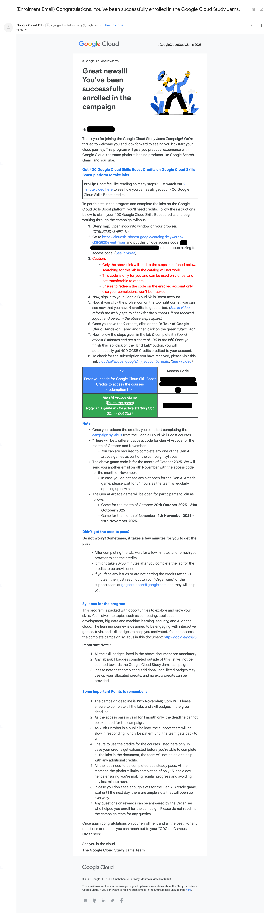
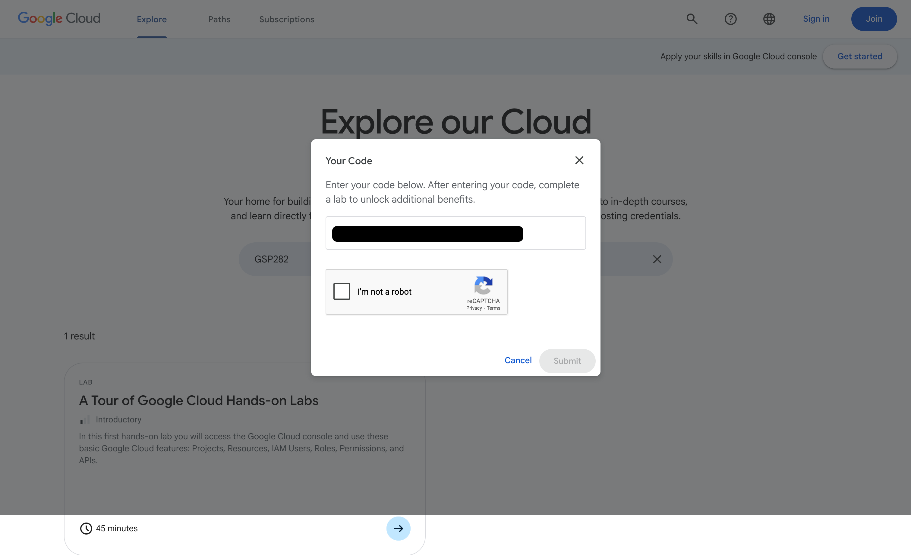
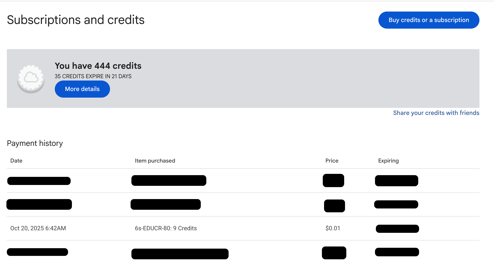
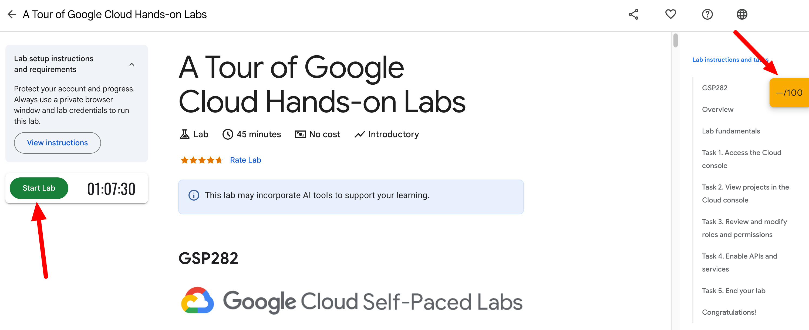
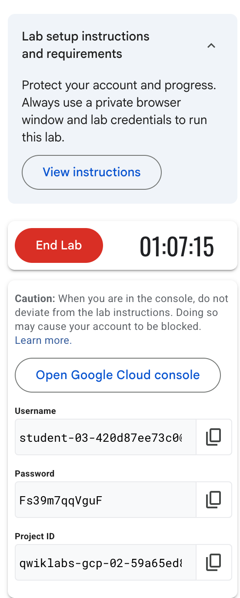
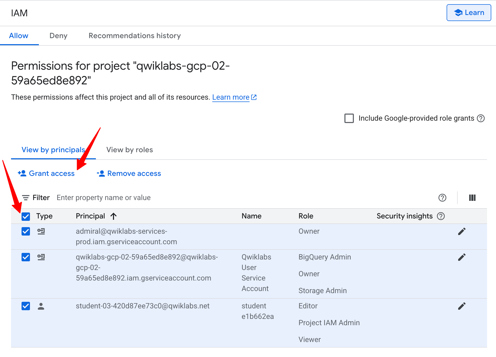
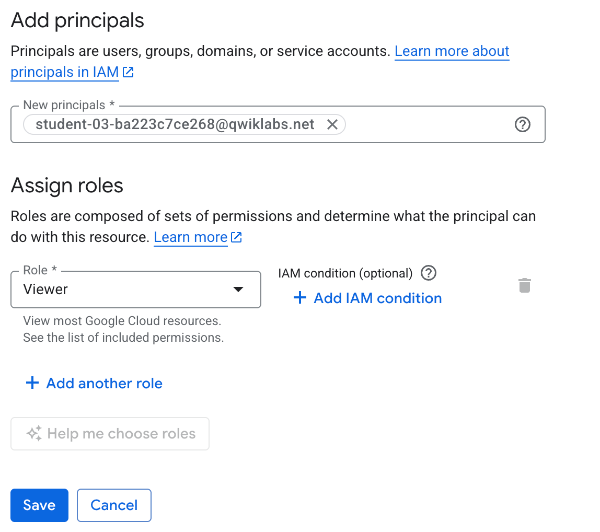
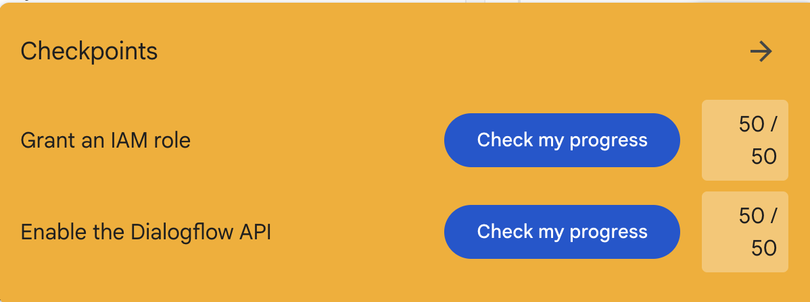

First you open a private tab after recived this mail:
```
Cnt/Cmd+Shift+N
```


**Step 1:** Go to the new incognito tab.

**Step 2:** Paste the link [https://cloudskillsboost.google/catalog?keywords=GSP282&event=Your](https://c.gle/AF5yWjDA4nYqsppDoCDUJ8zaWeKJjwhrEpsUjVIUaPm59U30blttix-OcQdVeFm3gPHLPagUg0JvYPX5VLthD70jABVvcdFCMs_4GJUImuwP9nZ6OXDpT7Kh7KfWkDgIJKzOucK7Q2yXVnFTgtZsGuG0k3gDYgWpMpTOG2XpLUjbqV8), and put this unique access code <br>


**Step 3:** After that sign in with your register mail id, just click on your profile, where you see the credit or use this link https://www.cloudskillsboost.google/my_account/credits and you will see the 9 credits 
<p style="color:red"><b>Note:</b> If you not see 9 credit repeat it</p>



**Step 4:** You see the Course the [A Tour of Google Cloud Hands-on Labs](https://www.cloudskillsboost.google/focuses/2794?catalog_rank=%7B%22rank%22%3A1%2C%22num_filters%22%3A0%2C%22has_search%22%3Atrue%7D&parent=catalog&search_id=56263099), just click on the course and start the Lab.
<p style="color:red"><b>Note:</b> Make sure you are in private tab.</p>



**Step 5:** Now you see the `Username`,`Password`,`Project ID`, click on the [Open Google Cloud console](https://accounts.google.com/AddSession?service=accountsettings&sarp=1&continue=https%3A%2F%2Fconsole.cloud.google.com%2Fhome%2Fdashboard%3Fproject%3Dqwiklabs-gcp-02-59a65ed8e892#Email=) and just copy the `Username` and `Password` and past it. <br>


**Step 6:** Now you see the a message `Welcome the new Google Account` just click `I understand`.

**Step 7:** Now you one more message, just click on the `I aggree` and continue it.

**Step 8:** In left you see the `View all products` just click on the and you see the [IAM & Admin](https://console.cloud.google.com/iam-admin?authuser=1&project=qwiklabs-gcp-02-59a65ed8e892) click on that.

**Step 9:** You see the some check box, select all the check box, and click Grant access. <br>


**Step 10:** You enter the principle, this will present in the course details in `Task 3. Review and modify roles and permissions`, then just save it. <br>


**Step 11:** Then search **Dialogflow API** in search box and just `Enable` it

**Step 12:** Go to course again and just click on `Check my progress`. <br> 


**Step 13:** Now just end the lab and make sure you sped at least 6 min in the lab and your score should be 100/100.

**Step 14:** Now you check the credit again you will get you 400 credit in your account.
